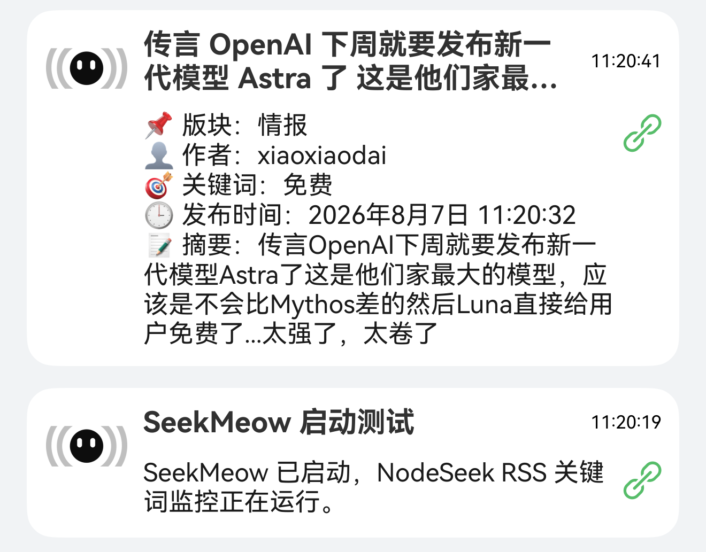

<div align="center">
  <h1>SeekMeow</h1>
  <p>自动监控 NodeSeek 新帖，按关键词筛选后推送到 MeoW。</p>
</div>

<p align="center">
  <a href="https://github.com/sunnyhmz7010/SeekMeow/releases"></a>
  <a href="https://github.com/sunnyhmz7010/SeekMeow/blob/main/LICENSE"></a>
</p>

---

## ✨ 为什么做这个项目

NodeSeek 上的 VPS 优惠、补货信息转瞬即逝，手动刷新既费时又容易错过。SeekMeow 自动订阅 NodeSeek 官方 RSS，根据你设置的关键词筛选帖子并推送到 MeoW。全程不需要 NodeSeek 账号或浏览器，一个 Docker 命令就能跑起来。

## 📸 截图预览



## 🚀 核心能力

- 官方 RSS 直连：只依赖 `https://rss.nodeseek.com/`，无需账号、Cookie、前端页面或端口映射
- 灵活匹配规则：普通关键词、组合关键词、正则表达式、版块匹配四种规则可叠加，还支持版块过滤与屏蔽词
- 精准命中范围：可单独匹配标题或 RSS 摘要，也可同时匹配两者
- 友好通知内容：推送正文显示中文版块、作者、关键词、中文发布时间和完整摘要，并使用 NodeSeek 图标
- 失败自动重试：推送失败的消息持久化保留，容器重启后继续补推
- 去重防打扰：已处理帖子记录在本地状态文件，同一帖绝不重复推送
- 轻量容器化：Node.js 24 Alpine 镜像，Docker 一条命令启动，零配置目录挂载

## ⚡ 快速开始

### 📋 前置要求

- 一台能访问外网的 VPS 或 NAS（需能连接 `rss.nodeseek.com` 和 `api.chuckfang.com`，无需开放入站端口）
- Docker（18.09+）
- 一个 MeoW 昵称（`https://api.chuckfang.com/{你的昵称}/NodeSeek`）

### 📦 Docker Compose（推荐）

新建 `compose.yaml`，写入以下内容：

```yaml
services:
  seekmeow:
    image: ghcr.io/sunnyhmz7010/seekmeow:latest
    container_name: seekmeow
    restart: unless-stopped
    environment:
      - MEOW_NICKNAME=你的昵称
      - CHECK_INTERVAL_SECONDS=5
      - CATEGORIES=all
      - MATCH_SCOPE=all
      - KEYWORDS=VPS,优惠,补货
      - KEYWORD_GROUPS=[["香港","VPS"],["日本","线路"]]
      - REGEX_PATTERNS=["年付\\s*\\d+","香港|日本"]
      - PUSH_CATEGORY=trade
      - BLOCK_KEYWORDS=求购,已收
      - PUSH_EXISTING=false
      - HEALTH_CHECK_MINUTES=60
```

然后启动：

```bash
docker compose up -d
```

查看日志：

```bash
docker compose logs -f
```

容器不监听端口，也不要求映射目录。启动时会先向 MeoW 发送一条测试推送；测试推送失败时容器会启动失败，并在日志中显示错误。首次启动默认把当前 RSS 条目作为基线，只推送之后出现的新帖；设置 `PUSH_EXISTING=true` 后会同时检查当前 RSS 中已有的帖子。

### 🖥️ 命令行方式

```bash
docker run -d \
  --name seekmeow \
  --restart unless-stopped \
  -e MEOW_NICKNAME="你的昵称" \
  -e CHECK_INTERVAL_SECONDS=5 \
  -e CATEGORIES=all \
  -e MATCH_SCOPE=all \
  -e KEYWORDS="VPS,优惠,补货" \
  -e KEYWORD_GROUPS='[["香港","VPS"],["日本","线路"]]' \
  -e REGEX_PATTERNS='["年付\\s*\\d+","香港|日本"]' \
  -e PUSH_CATEGORY=trade \
  -e BLOCK_KEYWORDS="求购,已收" \
  -e PUSH_EXISTING=false \
  -e HEALTH_CHECK_MINUTES=60 \
  ghcr.io/sunnyhmz7010/seekmeow:latest
```

### 🛠️ 自行构建镜像

如果你想自己构建而不是使用预构建镜像：

```bash
git clone https://github.com/sunnyhmz7010/SeekMeow.git
cd SeekMeow
docker build -t seekmeow .
docker run -d \
  --name seekmeow \
  --restart unless-stopped \
  -e MEOW_NICKNAME="你的昵称" \
  -e CHECK_INTERVAL_SECONDS=5 \
  -e CATEGORIES=all \
  -e MATCH_SCOPE=all \
  -e KEYWORDS="VPS,优惠,补货" \
  -e KEYWORD_GROUPS='[["香港","VPS"],["日本","线路"]]' \
  -e REGEX_PATTERNS='["年付\\s*\\d+","香港|日本"]' \
  -e PUSH_CATEGORY=trade \
  -e BLOCK_KEYWORDS="求购,已收" \
  -e PUSH_EXISTING=false \
  -e HEALTH_CHECK_MINUTES=60 \
  seekmeow
```

如果用 Docker Compose，把 `compose.yaml` 里的 `image: ghcr.io/...` 换成 `build: .`，然后 `docker compose up -d --build`。

## 📖 使用说明

### 📋 环境变量

| 变量 | 必填 | 默认值 | 说明 |
| --- | --- | --- | --- |
| `MEOW_NICKNAME` | 是 | - | MeoW 用户昵称，不能包含 `/` |
| `CHECK_INTERVAL_SECONDS` | 否 | `5` | 检查新帖的间隔（秒），范围 1-2147483 |
| `CATEGORIES` | 否 | `all` | 全局版块过滤：`all` 不过滤，或用英文逗号分隔版块标识仅监控指定版块。所有匹配规则均受此限制 |
| `MATCH_SCOPE` | 否 | `all` | `title` 仅匹配标题，`summary` 仅匹配 RSS 摘要，`all` 同时匹配两者。仅对关键词/组合词/正则生效 |
| `KEYWORDS` | 条件必填 | - | 普通关键词，英文逗号分隔。命中任意一个即推送 |
| `KEYWORD_GROUPS` | 条件必填 | `[]` | 组合关键词，JSON 二维数组格式如 `[["词A","词B"]]`。同组内所有词同时命中才推送，不同组命中任一组即推送 |
| `REGEX_PATTERNS` | 条件必填 | `[]` | 正则表达式，JSON 字符串数组格式如 `["年付\\s*\\d+"]`。命中任意一个即推送，固定使用 `iu` 标志 |
| `PUSH_CATEGORY` | 条件必填 | - | 版块匹配：设为 `all` 或英文逗号分隔的版块标识如 `trade,daily`，命中指定版块即推送。与关键词/组合词/正则的匹配结果取并集 |
| `BLOCK_KEYWORDS` | 否 | - | 屏蔽词，英文逗号分隔。命中任意一个即跳过推送，在所有匹配规则中均生效 |
| `PUSH_EXISTING` | 否 | `false` | 首次启动时是否还对 RSS 中已有的帖子执行匹配和推送 |
| `HEALTH_CHECK_MINUTES` | 否 | `60` | 定时自检间隔（分钟），范围 0-1440。设为 0 关闭自检。自检时会验证 RSS 与 MeoW 连接并推送一条通知 |

> `KEYWORDS`、`KEYWORD_GROUPS`、`REGEX_PATTERNS`、`PUSH_CATEGORY` 四项至少配置一种。

可选版块标识：
`daily` `tech` `info` `review` `trade` `carpool` `promo` `life` `dev` `photo-share` `expose` `inner` `sandbox`

### 📜 日志与去重

```bash
docker logs -f seekmeow
```

同一容器执行 `docker restart` 时会保留去重状态和待重试消息；删除并重建容器后，按照 `PUSH_EXISTING` 重新执行首次扫描规则。

## 🧠 功能细节

- 状态持久化：已处理帖子 ID 与待重试消息保存在 `/app/data/state.json`，采用临时文件 + 原子重命名写入，避免中途崩溃损坏状态
- 无头静默解析：RSS 摘要经 XML 解析清洗为纯文本再参与匹配，规避 HTML 干扰
- 优先级策略：屏蔽词 > 版块过滤 > 关键词 / 组合词 / 正则 / 版块匹配，命中即推送
- 有序轮询：条目按发布时间升序处理，保证补推顺序与真实发帖顺序一致
- 优雅退出：收到 `SIGTERM` / `SIGINT` 后等待当前轮次完成再退出，避免状态丢失

## 🧱 技术栈

- Node.js：>=24（ESM，`node --test` 内置测试）
- @xmldom/xmldom：RSS/HTML 解析
- 目标平台：Docker（node:24-alpine）或任意 Node.js 24+ 环境

## 🗂️ 项目结构

```
SeekMeow/
├── src/                    # 源码
│   ├── index.js            # 入口：组装依赖、信号处理、主循环
│   ├── config.js           # 环境变量解析与校验
│   ├── feed.js             # RSS 抓取与 XML 解析
│   ├── matcher.js          # 关键词 / 组合词 / 正则 / 版块匹配
│   ├── meow.js             # MeoW 推送客户端
│   ├── monitor.js          # 轮询调度、去重与失败重试
│   └── state.js            # 状态持久化存储（原子写入）
├── test/                   # 单元测试（node --test）
├── .github/ISSUE_TEMPLATE/ # Issue 模板
├── Dockerfile              # 容器镜像定义
├── .env.example            # 环境变量示例
└── package.json            # 依赖与脚本
```

## 👨‍💻 本地开发

### 🧰 环境

- Node.js >= 24
- 无需安装任何运行时服务，测试为纯离线单元测试

### ⚙️ 命令

```bash
npm install
npm test
```

## 🔐 安全报告

如果发现安全问题，请不要公开披露。请参考 [SECURITY.md](./SECURITY.md) 提交安全报告。

## 📄 许可证

本项目基于 [GPL-3.0](./LICENSE) 开源。

<div align="center">
  <sub>Built with ❤️ by Sunny</sub>
</div>
